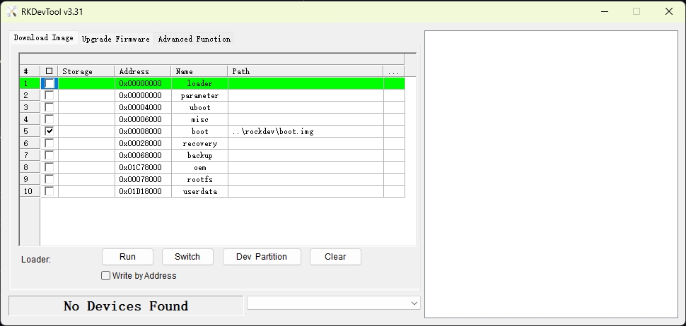

# ArceOS-Hypervisor Supported GuestVMs

## [NimbOS](https://github.com/arceos-hypervisor/nimbos)

* Simple real time guest VM that can only be used for **single-core** testing
* It supports the x86_64, aarch64, and riscv64 architectures
* Configuration file templates at [nimbos-aarch64.toml](../configs/vms/nimbos-aarch64.toml), [nimbos-x86_64.toml](../configs/vms/nimbos-x86_64.toml), and [nimbos-riscv64.toml](../configs/vms/nimbos-riscv64.toml)
* Kernel binary images availble at [nimbos/releases](https://github.com/arceos-hypervisor/nimbos/releases/tag/v0.6)

## [ArceOS](https://github.com/arceos-hypervisor/arceos)
* Used for **SMP** testing
* It supports the x86_64, aarch64, and riscv64 architectures
* Configuration file templates at [arceos-aarch64.toml](../configs/vms/arceos-aarch64.toml), [arceos-x86_64.toml](../configs/vms/arceos-x86_64.toml), and [arceos-riscv64.toml](../configs/vms/arceos-riscv64.toml)

### Testcases

* **Hypercall**:
    * ArceOS HelloWorld application that can be used to test hypercall functionality is provided [here](https://github.com/arceos-hypervisor/arceos/blob/gvm_test/examples/helloworld/src/main.rs)
    * Just run `make A=examples/helloworld ARCH=[x86_64|aarch64|riscv64] build` to get binary images 

* **virtio-pci-devices (PCI)**: 
    * Branch (pci_pio)[https://github.com/hky1999/arceos/tree/pci_pio] can be used for virtio-pci devices testing (PCI device probed through port I/O)

## [axvm-bios](https://github.com/arceos-hypervisor/axvm-bios-x86)

* A extremely simple bios for x86_64 guests
* It can act as a bootloader for NimbOS and ArceOS
* Binary product available at [here](https://github.com/arceos-hypervisor/axvm-bios-x86/releases/download/v0.1/axvm-bios.bin)

# ArceOS-Hypervisor in RK3588 board
## How to run ArceOS on rk3588
1. Prepare your kernal file `linux-rk3588-aarch64.bin` and DTB file `rk3588.dtb`.
2. Set the kernel path and DTB path in the configuration file `configs/vms/linux-rk3588-aarch64.toml`.
   ```toml
   image_location = "memory"
   kernel_path = "/path/to/linux-rk3588-aarch64.bin"
   dtb_path = "/path/to/rk3588.dtb"
   ```
3. Use Command `make A=(pwd) ARCH=aarch64 VM_CONFIGS=configs/vms/linux-rk3588-aarch64.toml kernel` to build the kernel image `boot.img`.
4. Download the [RKDevTool](https://download.t-firefly.com/product/Board/RK3588/Tool/Window/RKDevTool_Release_v3.31.zip). 
    >This tool has only been tested on [Pji's](https://www.pji.net.cn/) Electronic Control Unit of RK3588. Other RK3588 development boards require independent testing.
5. Set the path of `boot.img` in **boot** and connect the RK3588 board.
6. Press the `Run` button to flash the image to the RK3588 board.
