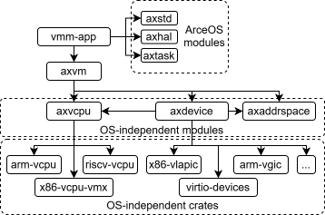

# Axvisor Architecture Overview

About the overall architecture of Axvisor (the [main repo](https://github.com/arceos-hypervisor/axvisor) and [all components repos](https://github.com/arceos-hypervisor/)), 
a unified modular hypervisor based on [ArceOS](https://github.com/arceos-org/arceos).

The hypervisor mainly consists of the VMM (Virtual Machine Monitor) app named `axvisor` (the very repo you are looking at) and modules/crates responsible for implementing virtualization functions (e.g., `axvm`, `axvcpu`, `axdevice`, etc., which are in separate repos under the [arceos-hypervisor](https://github.com/arceos-hypervisor/) organization).

## Design Goal

This project originated from the [discussion/13](https://github.com/orgs/rcore-os/discussions/13) of [rCore-OS](https://github.com/rcore-os) community.

In general, this project hopes to build a modular hypervisor that supports multiple architectures based on the basic OS functions provided by ArceOS unikernel through add several virtualization support modules/crates.

We hope to make the hypervisor as modular as possible and minimize modifications to the arceos kernel code while maximizing the reuse of codes across different architectures.

## Components

Axvisor runs as an ArceOS app, mainly composed of the following independent components:

(The definitions of ArceOS crates and modules can be seen in [ArceOS/doc/README.md](https://github.com/arceos-org/arceos/blob/main/doc/README.md))

### The App `axvisor`

A user app of ArceOS, which is:
* completely architecture-independent,
* main entry point of the hypervisor, and
* responsible for VM management (configuration & runtime).

**Note that we aim to consolidate all dependencies on ArceOS within the vmm-app.** Currently, the modules from ArceOS that the vmm-app depends on include:
* [axstd](https://github.com/arceos-hypervisor/arceos/tree/vmm/ulib/axstd): a standard dependency interface for ArceOS's user app.
* [axhal](https://github.com/arceos-hypervisor/arceos/tree/vmm/modules/axhal): for OS-related functions, including memory management, clock operations, and more.
* [axtask](https://github.com/arceos-org/arceos/tree/monolithic/modules/axtask): for the scheduling of vCPUs.

### Modules

* [axvm](https://github.com/arceos-hypervisor/axvm): responsible for **resource management** within each VM.
    * partially architecture-independent.
    * resources include:
        * vcpu: [axvcpu](https://github.com/arceos-hypervisor/axvcpu) list.
        * memory: [axaddrspace](https://github.com/arceos-hypervisor/axaddrspace) for guest memory management.
        * device: [axdevice](https://github.com/arceos-hypervisor/axdevice) list.

* [axvcpu](https://github.com/arceos-hypervisor/axvcpu): providing CPU virtualization support.
    * highly architecture-dependent.
    * stores exception context frame of different architecture.
    * basic scheduling item.
	* arch-specific vcpu implementations need to be separated into separate crates.

* [axaddrspace](https://github.com/arceos-hypervisor/axaddrspace).
	* architecture-independent.
	* responsible for managing and mapping the guest VM's second-stage address space (GPA -> HPA).

* [axdevice](https://github.com/arceos-hypervisor/axdevice): providing device emulation support.
    * partially architecture-independent.
    * different emulated device implementations need to be separated into separate crates.

### Crates

`crates` includes implementations of VCpus for different architectures, various emulated devices, and other utilities.

## Dependency diagram



Since modules/crates used for virtualization functionality in the ArceOS-Hypervisor architecture need to call OS-related resource management interfaces, while we aim to consolidate all OS-related dependencies within the vmm-app. 

Various modules/crates will achieve dependency injection through Rust traits.

### axvm

The axvm crate defines the `AxVMHal trait`, which is a combination of generic types defined by `axaddrspace`, `axvcpu`, and `axdevice`. The `vmm-app` needs to implement the `AxVMHal` trait for `axvm` by calling system interfaces provided by ArceOS (or other OSs).


### axvcpu

Typically, `axvcpu` focuses on CPU virtualization support across different architectures, including managing registers for guest VM CPU context and virtualizing hardware abstractions, which generally does not depend on OS functionalities.

However, for the x86 architecture, VMX requires allocating physical page frames for managing VMX regions (such as VMCS regions), which depends on OS-related memory allocation APIs. 
This can be handled by importing the `PagingHandler` generic type, or passing pre-allocated physical page frames as parameters in the vCPU constructor.

### axaddrspace

The `struct AddrSpace` in `axaddrspace` uses a generic type parameter `<H>` constrained by the `PagingHandler trait` from [`page_table_multiarch`](https://crates.io/crates/page_table_multiarch).

While `PagingHandler` is an associated type of `AxVMHal trait`.

### axdevice

`axdevice` depends on `axaddrspace` to handle the guest request's parsing process in device emulation. 
For example, when handling a Virtio request, the virtio-device needs to translate the accessed GPA into HVA and to perform subsequent operations.

Additionally, axdevice depends on certain interfaces provided by the VMM to perform operations like interrupt injection and inter-VM communication.

## Example about how we achieve dependency injection

Taking [`axaddrspace`](https://github.com/arceos-hypervisor/axaddrspace) for an example, its [`AddrSpace`](https://github.com/arceos-hypervisor/axaddrspace/blob/d377e5aa4eb06afa50a3a901ec3239559be1eb51/src/address_space.rs#L16C12-L16C21) represents memory regions and two-stage address mapping for guest VM, which relies on a generic type `PagingHandler` for page table related stuff.

```Rust
/// The virtual memory address space.
pub struct AddrSpace<H: PagingHandler> {
    va_range: VirtAddrRange,
    areas: MemorySet<MappingFlags, PageTable<H>, Backend>,
    pt: PageTable<H>,
}
```

`axaddrspace` is owned and managed by `axvm`'s `AxVM` structure, which replies on `AxVMHal` trait ( defined in `axvm`'s [hal.rs](https://github.com/arceos-hypervisor/axvm/blob/master/src/hal.rs) ) .

Indeed, `PagingHandler` is a associate type of `AxVMHal` trait.

```Rust
/// The interfaces which the underlying software (kernel or hypervisor) must implement.
pub trait AxVMHal: Sized {
    type PagingHandler: page_table_multiarch::PagingHandler;
    /// Converts a virtual address to the corresponding physical address.
    fn virt_to_phys(vaddr: HostVirtAddr) -> HostPhysAddr;
    /// Current time in nanoseconds.
    fn current_time_nanos() -> u64;
	// ...
}
```

While `AxVMHal` is implemented by `AxVMHalImpl` in vmm-app, which rely on `PagingHandlerImpl` from `ArceOS`'s `axhal` module to implement its associate type `PagingHandler`.

```Rust
pub struct AxVMHalImpl;

impl AxVMHal for AxVMHalImpl {
    type PagingHandler = axhal::paging::PagingHandlerImpl;
    fn virt_to_phys(vaddr: VirtAddr) -> PhysAddr {
        axhal::mem::virt_to_phys(vaddr)
    }
    fn current_time_nanos() -> u64 {
        axhal::time::monotonic_time_nanos()
    }
	// ...
}
```

So, current design achieve dependency injection through Rust's generic type (`Trait`) and its associate type mechanism.

For other virtualization-related modules/crates such as `axvcpu`, `axdevice`, etc., 
we also want them to expose well-designed generics, and to converge these carefully crafted generics as subtraits or associated types within the `AxVmHal trait` of `axvm` (since `axvm` is reponsible for VM resource management). 

Ultimately, the `vmm-app` layer will call the relevant functionalities of `ArceOS` to implement them.